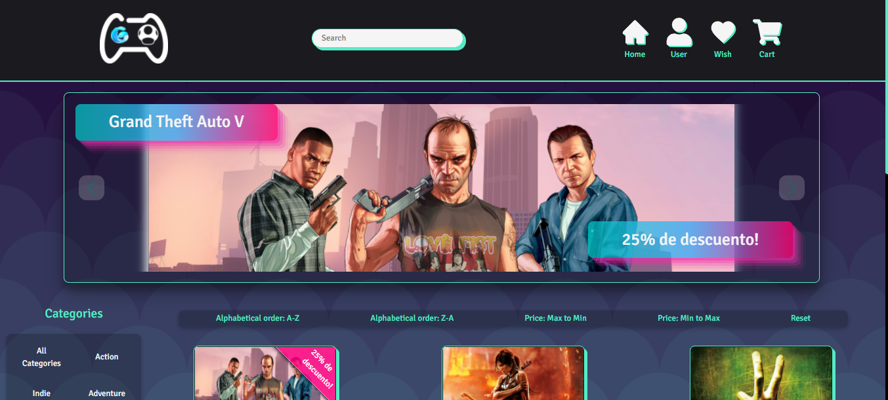
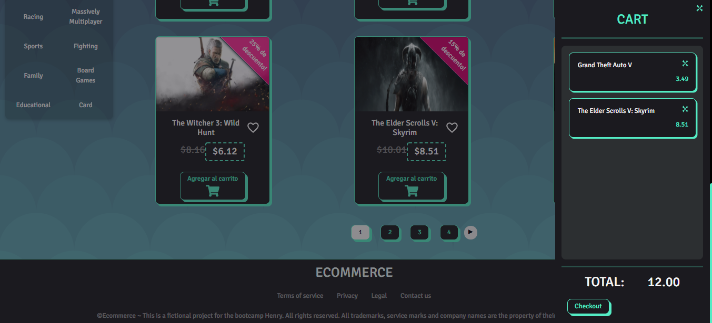
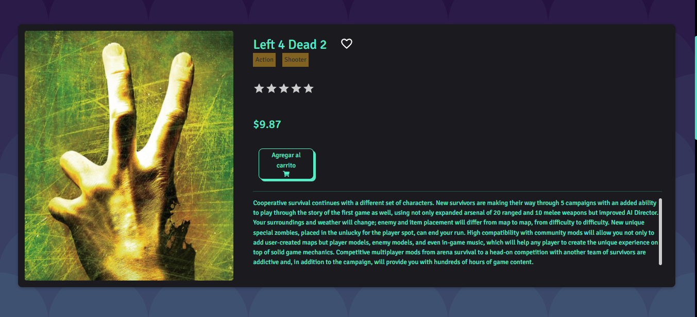
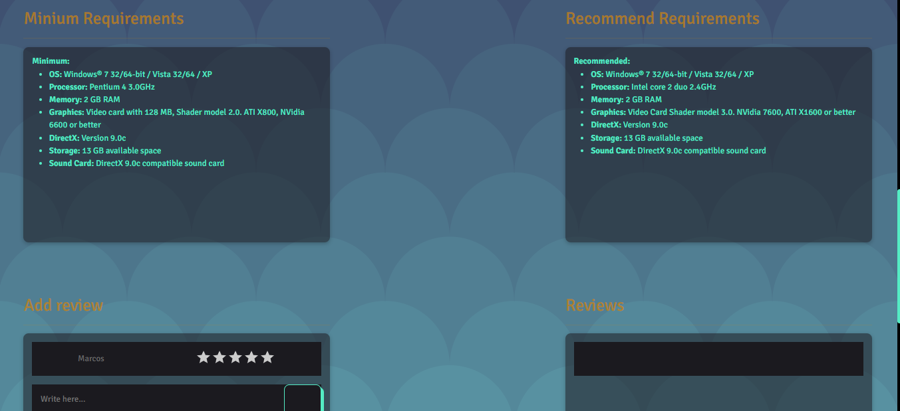
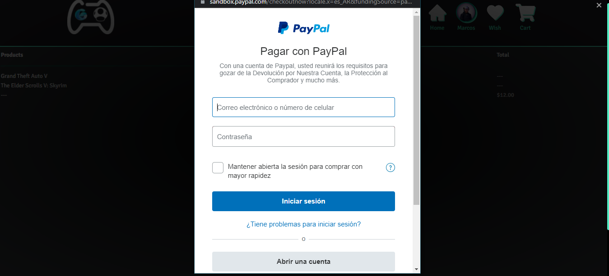
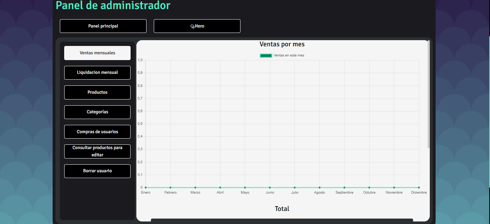
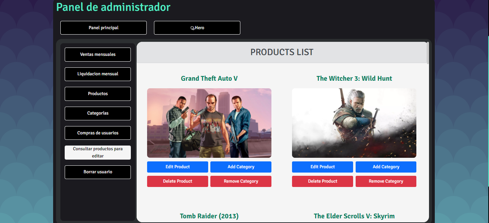
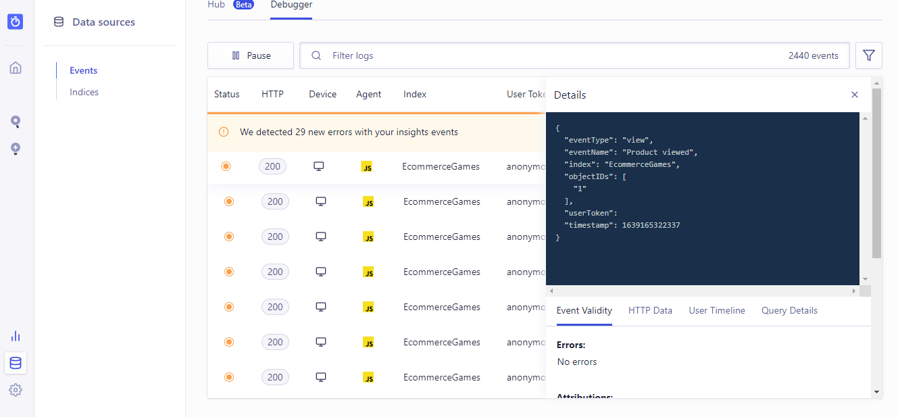

# server

# Ecommerce Games

En este proyecto implementamos las tecnologias aprendidas durante nuestro transcurso en el bootcamp de Henry ademas de algunas investigadas por nuestra cuenta para lograr como resultado este ecommerce donde el objetivo es la comercializacion de video juegos tal como lo harian plataformas como Steam o Epic.

## El resultado

### Home

### Cart

### Detalles de producto

### Checkout

### Admin Panel

### Implementacion Machine Learning

# Used technologies:
   - [ ] Javascript
   - [ ] React
   - [ ] Redux
   - [ ] Node
   - [ ] Express
   - [ ] CSS
   - [ ] Sequelize - Postgres
   - [ ] Styled Components
   - [ ] PayPal Checkout
   - [ ] Algolia Insights

## We awaiting your message!!
